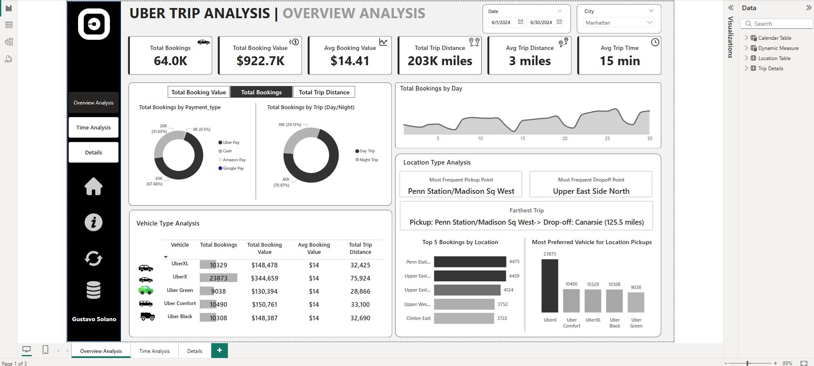
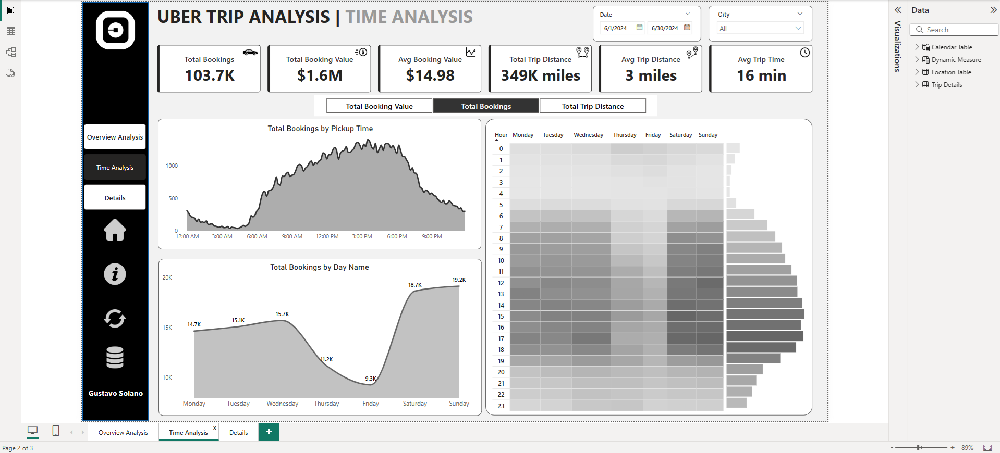
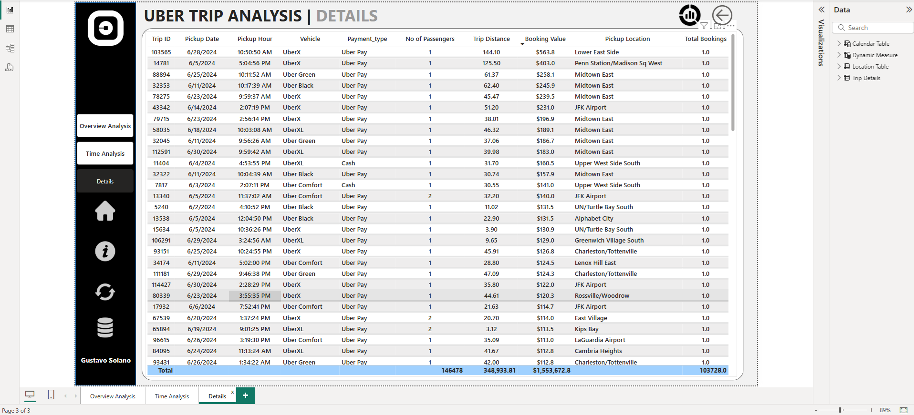

# Uber Trip Analysis

This project presents an interactive Uber Trip Analysis Dashboard designed to track key performance indicators (KPIs) and provide insights into trip trends. 

# KPIs

1.	Total Bookings – How many trips were booked over a given period?
2.	Total Booking Value – What is the total revenue generated from all bookings?
3.	Average Booking Value – What is the average revenue per booking?
4.	Total Trip Distance – What is the total distance covered by all trips?
5.	Average Trip Distance – How far are customers traveling on average per trip?
6.	Average Trip Time – What is the average duration of trips?

## Overview Analysis

Analyse Uber trip data using Power BI to gain insights into booking trends, revenue, and trip efficiency, helping stakeholders make data-driven decisions.

# Time Analysis

To understand trip patterns based on time, Uber needs to analyse ride demand and trends across different time intervals. This dashboard will help in optimizing operations, pricing, and driver availability.

# Details View

To provide in-depth insights and allow users to explore granular data, a Grid Tab will be created. This tab will enable drill-through functionality, allowing users to access detailed records based on selections made in other dashboards.

